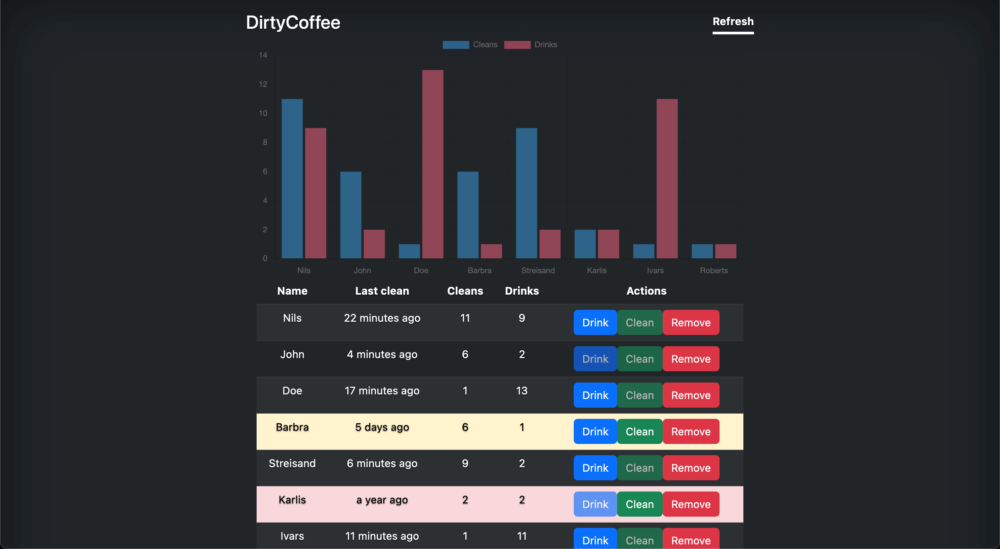

# About
DirtyCoffee is a convenient tool for promoting a fair and organized approach to coffee machine maintenance within the workplace, ensuring that the responsibility is evenly distributed among employees. Place a tablet next to your coffee machine and let DirtyCoffee handle the rest.

# Features
- Track cleaning and drinking habits of employees
- Highlight employees who haven't cleaned the coffee machine for a long time
- Display time elapsed since the last clean or drink
- Interactive charts to visualize habits and statistics
- Integration with Moment.js for precise time calculations
- Bootstrap framework for responsive design and visual enhancements

# Install
```
python3 -m pip install -r requirements.txt
npm i bootstrap@5.3.0
npm i jquery
npm i moment
npm i chart.js
```

# Usage
`python3 main.py`